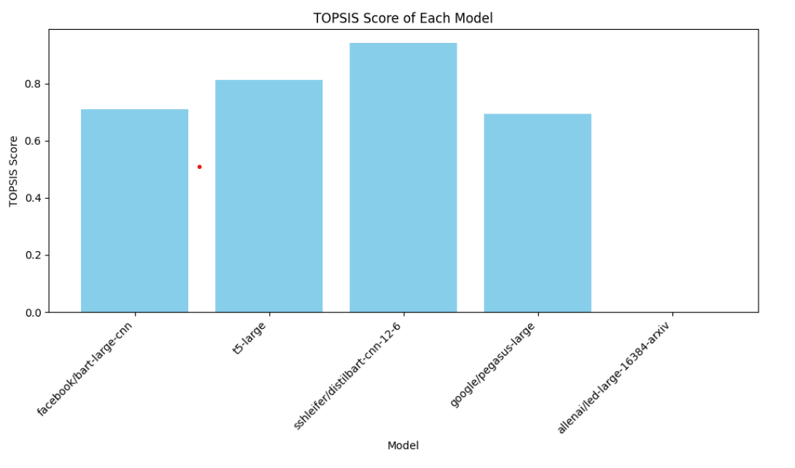

# TextSummarization-Topsis

We were required to use TOPSIS to identify the optimal pre-trained model for text summarization for this assignment.

Hugging face data was utilised for the set.

There were 12500 entries in the initial dataset. In order to streamline the process and minimise the duration of training, I decreased the row size.

Four criteria for summarising text

1.  Bleu Score: The Bilingual Evaluation Understudy (BLEU) is a metric utilised to assess the quality of a candidate translation by comparing it to one or more recommended translations. While primarily designed for translation purposes, this tool can also be applied to assess text produced for various natural language processing endeavours.

2.  Semantic Coherence: The metric of semantic coherence exhibits a strong correlation with human evaluation of topic quality and is optimised when the most probable terms in a particular subject frequently appear together.

3.  Factual accuracy refers to the absence of errors or inaccuracies in the information provided regarding specific details, incidents, or data.

4.  Content coverage is a metric used to evaluate the degree to which the generated summary encompasses significant information derived from the dialogue. Enhanced content coverage signifies more comprehensive presentation of pertinent information.

Fifth Pre-trained Model
1.Bart Large CNN's Facebook page 2. T5-LAR 3. Shondelfer and Distilbart (CNN-12-6) 4. Pegasus-large on Google 5. led by Allenai (16384 Arxiv)

# Topsis
Evaluation_results.csv was the file containing the results.

Models were ranked and Topsis was executed on this CSV file.

Topsis.csv was utilised to store the result.

The graph depicting the topsis scores of each model is as follows:

